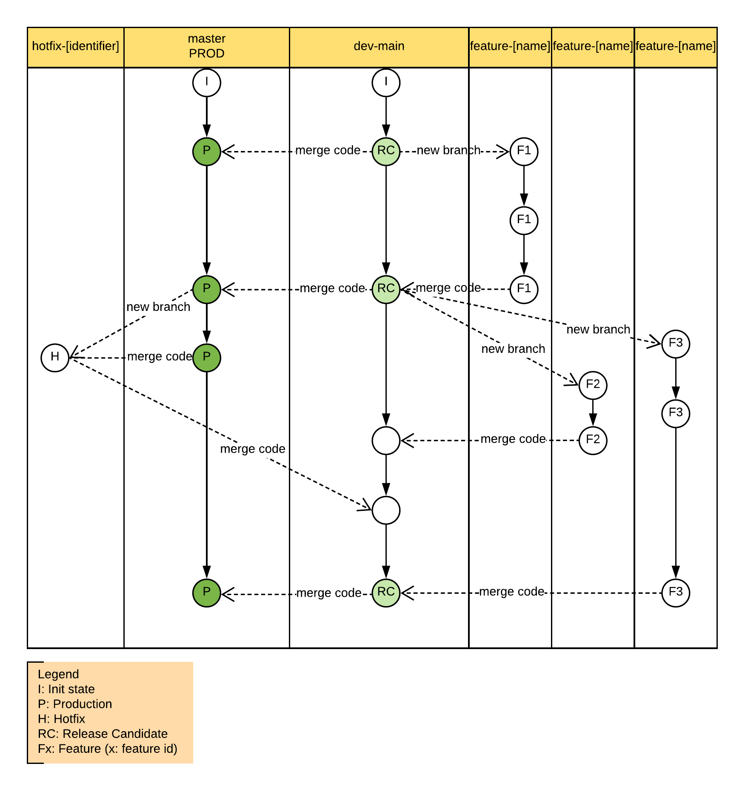
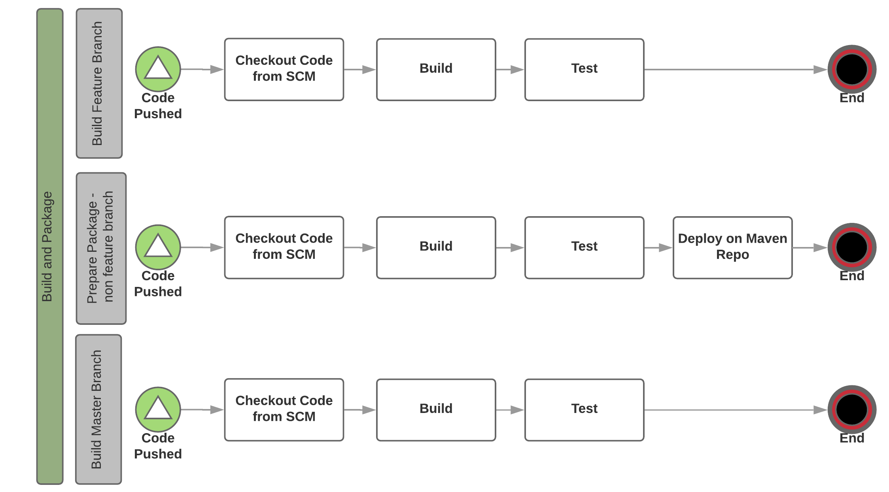
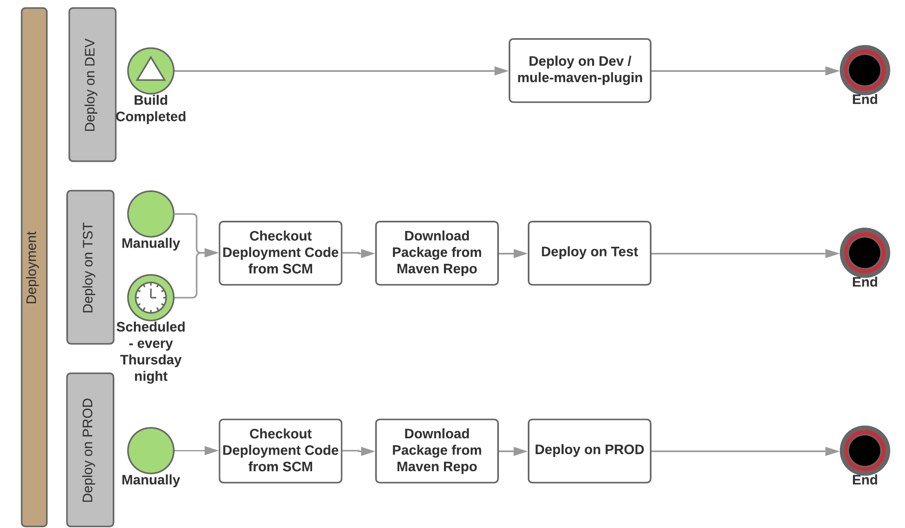

# CICD Hello World

**Automated build ready for self-service**

Project demonstrates DevOps best prectices, tooling and configuration and is mostly focused on CI.

**Key topics are:**

* Maven
  * (Internal) Maven Repository Configuration: `Nexus` has been used for the purposes of this document
  * Configuration on the global level: `settings.xml`
  * Configuration on the project level: `pom.xml`
    * [Mule maven plugin](https://docs.mulesoft.com/mule-user-guide/v/3.9/mule-maven-plugin): deployment on DEV environment
    * [Maven release plugin](http://maven.apache.org/maven-release/maven-release-plugin/)
    * [Maven scm plugin](https://maven.apache.org/scm/maven-scm-plugin/)
    * [MUnit](https://docs.mulesoft.com/munit/v/1.3/)
* Source code branching
* CI Pipeline design: `Jenkins` has been used to demostrate implementation of the proposed design

## Maven configuration

### Maven repository `Nexus`

[Repostiory Mirroring](https://maven.apache.org/guides/mini/guide-mirror-settings.html)

<details><summary><b>Sample Config - settings.xml</b></summary><p>
	
```xml
<mirrors>
  <mirror>
    <id>nexus</id>
    <mirrorOf>central</mirrorOf>
    <url>${MVNREPO_URL}/repository/${MVNREPO_CENTRAL}</url>
  </mirror>

  <mirror>
    <id>mule-extra-repos</id>
    <mirrorOf>mule-public</mirrorOf>
    <url>${MVNREPO_URL}/repository/${MVNREPO_MULE_PUBLIC}</url>
  </mirror>

  <mirror>
    <id>Mule</id>
    <mirrorOf>MuleRepository</mirrorOf>
    <url>${MVNREPO_URL}/repository/${MVNREPO_MULE_EE}</url>
  </mirror>
</mirrors>
```

</p></details>

### Deployment on DEV environment

<details><summary><b>Sample Config - on-prem runtime</b></summary><p>
	
```xml
<plugin>
  <groupId>org.mule.tools.maven</groupId>
  <artifactId>mule-maven-plugin</artifactId>
  <version>2.2.1</version>
  <configuration>
    <deploymentType>arm</deploymentType>
    <username>${MULEANYPOINT_USR}</username>
    <password>${MULEANYPOINT_PASSWORD}</password>
    <target>summer</target>
    <!-- One of: server, serverGroup, cluster -->
    <targetType>server</targetType>
    <environment>TEST</environment>
  </configuration>
  <executions>
    <execution>
      <id>deploy</id>
      <phase>deploy</phase>
      <goals>
        <goal>deploy</goal>
      </goals>
    </execution>
  </executions>
</plugin>
```

</p></details>

### MUnit

<details><summary><b>Sample Config</b></summary><p>
	
```xml
<plugin>
  <groupId>com.mulesoft.munit.tools</groupId>
  <artifactId>munit-maven-plugin</artifactId>
  <version>${munit.version}</version>
  <executions>
    <execution>
      <id>test</id>
      <phase>test</phase>
      <goals>
        <goal>test</goal>
      </goals>
    </execution>
  </executions>
  <configuration>
    <coverage>
      <runCoverage>true</runCoverage>
      <failBuild>true</failBuild>
      <requiredApplicationCoverage>80</requiredApplicationCoverage>
      <requiredFlowCoverage>80</requiredFlowCoverage>
      <formats>
        <format>html</format>
        <format>json</format>
      </formats>
    </coverage>
  </configuration>
</plugin>
```

</p></details>

## Source code branching



## CI Pipeline design




Deployment on TEST and Deployment on PROD is included just for illustration purposes. There are different tools and approaches that could help with application deployment. Some of them are mentioned in [Recommendations section](#recommendations).

### Pipeline as a Code

Pipeline defined in `Jenkinsfile` implements different stages of the build process depending on the source code branch that triggered the build execution as desribed in [parent section](#ci-pipeline-design).

#### Benefits of Pipeline

- Code: Pipelines are implemented in code and typically checked into source control, giving teams the ability to edit, review, and iterate upon their delivery pipeline.
- Durable: Pipelines can survive both planned and unplanned restarts of CI server
- Pausable: Pipelines can optionally stop and wait for human input or approval before continuing the Pipeline run.
- Versatile: Pipelines support complex real-world continuous delivery requirements, including the ability to fork/join, loop, and perform work in parallel.

### Jenkins configuration
* Environment variables
  * MULEANYPOINT_USR
  * MULEANYPOINT_PASSWORD
* `settings.xml` for Jenkins

## How to use `cicd_build_hello_world`
This project implements all patterns discussed above. It gives us the ability to quickly test and prove design decisions and configuration.

## Recommendations
Check the following [project](https://github.com/mulesoft-consulting/automated_api_promotion) for establishing simple CD within the organisation.

